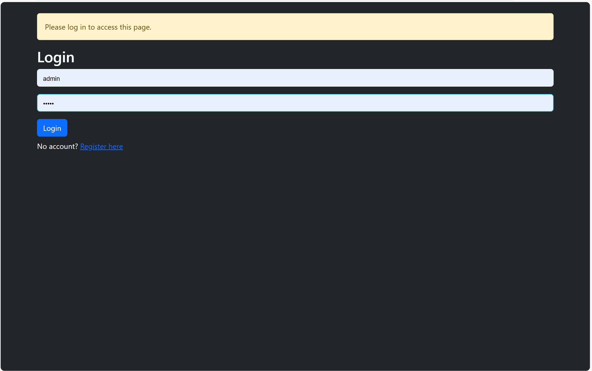
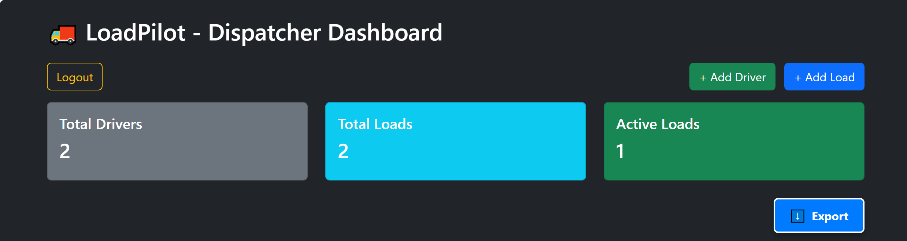
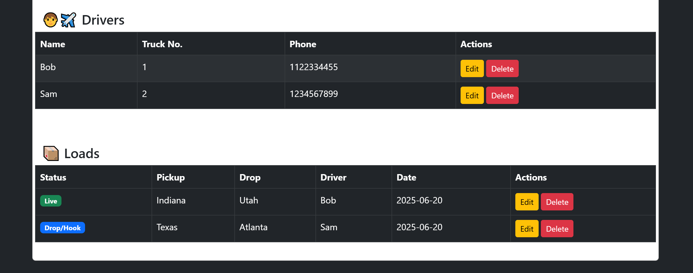
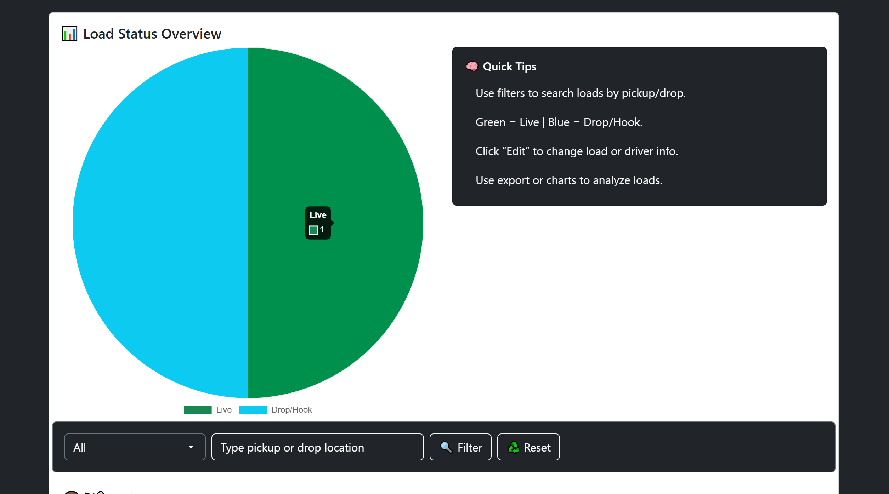

# 🚚 LoadPilot - Dispatcher Dashboard (Flask Web App)

LoadPilot is a Flask-based web dashboard built for trucking company dispatchers. It provides an easy way to manage drivers and loads, view load statuses, and filter/search tasks efficiently — all in one clean interface.

---

## ✨ Features

- ✅ User login & logout
- ✅ Add, edit, and delete drivers
- ✅ Add, edit, and delete loads
- ✅ Assign loads to drivers
- ✅ Filter loads by pickup, drop, or status
- ✅ Pie chart to visualize load status
- ✅ Export all load data as CSV
- ✅ Quick tips & helpful UI cues
- ✅ Clean, responsive dashboard 

---

## 📸 Screenshots

| Login / Register | Dashboard Overview |
|------------------|--------------------|
|  |  |

| Driver & Load Tables | Pie Chart & Quick Tips |
|-----------------------|------------------------|
|  |  |

---

## 🚀 How to Run Locally

### 1. Clone the Repository
```bash
git clone https://github.com/Kaur7611/loadpilot.git
cd loadpilot
